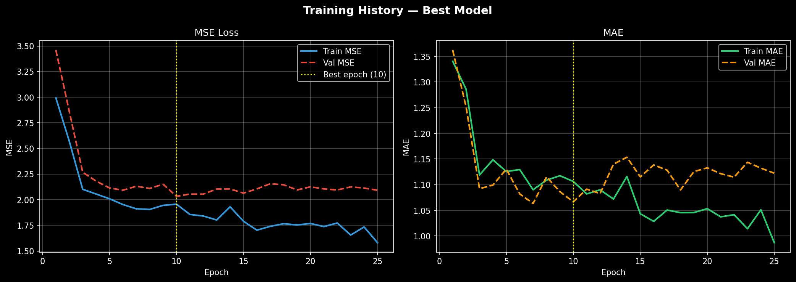
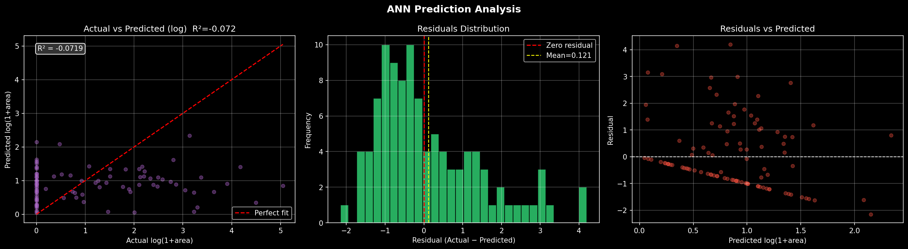
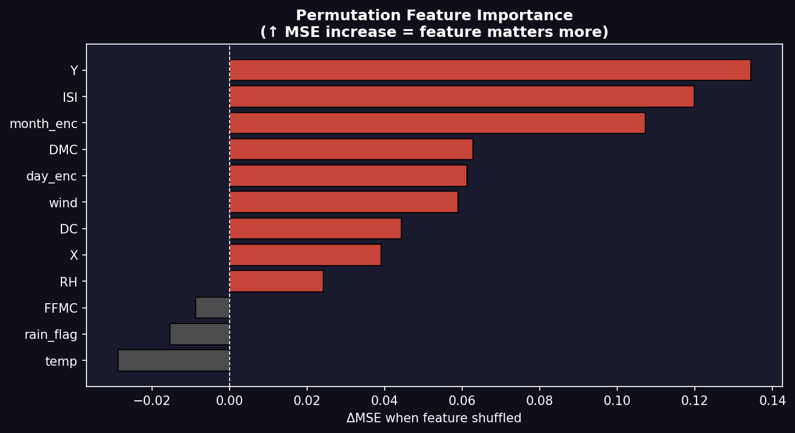

# 🔥 Forest Fire Burned Area Predictor


An interactive web application for predicting forest fire burned areas using Artificial Neural Networks (ANN). Built with Streamlit, this tool leverages meteorological data and the Fire Weather Index (FWI) system to provide early insights into fire behavior and severity.

## 📋 Table of Contents
- [Overview](#-overview)
- [Features](#-features)
- [Tech Stack](#-tech-stack)
- [Installation](#-installation)
- [Usage](#-usage)
- [Model Details](#-model-details)
- [Dataset](#-dataset)
- [Results](#-results)
- [Deployment](#-deployment)
- [Contributing](#-contributing)
- [License](#-license)

## 📌 Overview
This project implements a deep learning solution for forest fire prediction in the Montesinho Natural Park, Portugal. The ANN model analyzes meteorological conditions and FWI components to predict burned areas, helping in disaster management and resource allocation.

The application provides:
- Real-time predictions through an intuitive web interface
- Exploratory data analysis visualizations
- Model performance metrics and insights
- Interactive feature exploration

## ✨ Features
- **🔮 Real-time Prediction**: Input meteorological conditions to predict burned area
- **📊 Exploratory Data Analysis**: Interactive visualizations of the dataset
- **🧠 Model Insights**: Detailed model architecture and performance metrics
- **📈 Training Analytics**: View training curves and hyperparameter optimization
- **🎯 Feature Importance**: Understand which factors most influence fire spread
- **📱 Responsive UI**: Clean, modern interface built with Streamlit

## 🛠️ Tech Stack
- **Language**: Python 3.8+
- **Deep Learning**: TensorFlow/Keras
- **Web Framework**: Streamlit
- **Data Processing**: Pandas, NumPy
- **Visualization**: Matplotlib, Seaborn, Plotly
- **Preprocessing**: Scikit-learn (StandardScaler, LabelEncoder)

## 🚀 Installation

### Prerequisites
- Python 3.8 or higher
- pip package manager

### Local Setup
1. **Clone the repository**
   ```bash
   git clone https://github.com/your-username/forest-fire-predictor.git
   cd forest-fire-predictor
   ```

2. **Create virtual environment**
   ```bash
   python -m venv venv
   source venv/bin/activate  # On Windows: venv\Scripts\activate
   ```

3. **Install dependencies**
   ```bash
   pip install -r requirements.txt
   ```

4. **Run the application**
   ```bash
   streamlit run app.py
   ```

The app will open in your default browser at `http://localhost:8501`.

## 📖 Usage

### Making Predictions
1. Navigate to the "🎯 Predict" tab
2. Input meteorological conditions:
   - Map coordinates (X, Y)
   - Month and day
   - FWI components (FFMC, DMC, DC, ISI)
   - Temperature, humidity, wind speed
   - Rain amount
3. Click "Predict Burned Area" to get results

### Exploring Data
- **📊 EDA Tab**: Interactive charts and correlations
- **🧠 Model Info Tab**: Architecture details and performance metrics
- **📋 Dataset Tab**: Raw data exploration

## 🧠 Model Details

### Architecture
- **Type**: Artificial Neural Network (ANN)
- **Layers**: 2 hidden layers (128 → 64 units)
- **Activation**: ReLU for hidden layers, Linear for output
- **Regularization**: L2 regularization + Dropout (0.3, 0.1)
- **Optimizer**: Adam with learning rate 0.01

### Features Used
- Spatial coordinates (X, Y)
- Temporal features (month, day - label encoded)
- FWI components (FFMC, DMC, DC, ISI)
- Meteorological data (temp, RH, wind)
- Rain flag (binary indicator)

### Target Transformation
- Uses `log1p(area)` transformation to handle skewed distribution
- Predictions are inverse-transformed for interpretable results

### Performance Metrics
- **R² Score**: -0.0719 (log-space)
- **MAE**: 7.39 hectares
- **RMSE**: 20.45 hectares
- **Training Epochs**: 25 (early stopping at epoch 10)

## 📊 Dataset

### Source
[UCI Machine Learning Repository - Forest Fires Dataset](https://archive.ics.uci.edu/ml/datasets/forest+fires)

### Description
- **Location**: Montesinho Natural Park, Portugal
- **Period**: 2000-2003
- **Samples**: 517 records
- **Features**: 12 input features + 1 target (area)

### Key Features
| Feature | Description | Unit |
|---------|-------------|------|
| X, Y | Map coordinates | - |
| month, day | Temporal factors | - |
| FFMC | Fine Fuel Moisture Code | - |
| DMC | Duff Moisture Code | - |
| DC | Drought Code | - |
| ISI | Initial Spread Index | - |
| temp | Temperature | °C |
| RH | Relative Humidity | % |
| wind | Wind speed | km/h |
| rain | Rain amount | mm/m² |
| area | Burned area | hectares |

## 📈 Results

### Training Performance


### Prediction Analysis


### Feature Importance


## 🌐 Deployment

### Streamlit Cloud
1. Push repository to GitHub
2. Go to [share.streamlit.io](https://share.streamlit.io)
3. Create new app and select your repository
4. Set main file path to `app.py`
5. Deploy!

### Local Deployment
```bash
streamlit run app.py 
```
---
